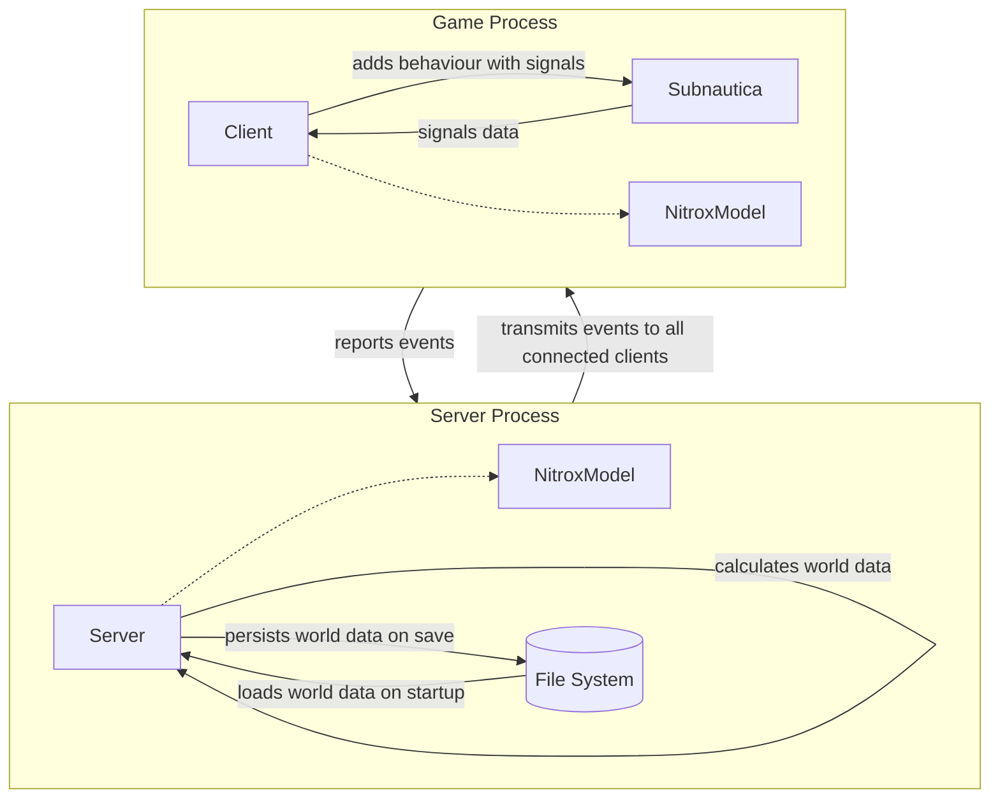

```mermaid
graph TD
    subgraph server [Server Process]
        direction LR
        Server -.-> ServerNitroxModel[NitroxModel]
        Server --> |calculates world data| Server
        Server --> |persists world data on save| Storage[(File System)]
        Storage --> |loads world data on startup| Server
    end
    
    subgraph game [Game Process]
        direction LR
        Client --> |adds behaviour with signals| Subnautica --> |signals data| Client
        Client -.-> ClientNitroxModel[NitroxModel]
    end
    server --> |transmits events to all connected clients| game
    game --> |reports events| server
```

## Terminology

- **World data** - Data about creatures, vehicles, bases, ...
- **Signal** - A C#/.NET event or callback